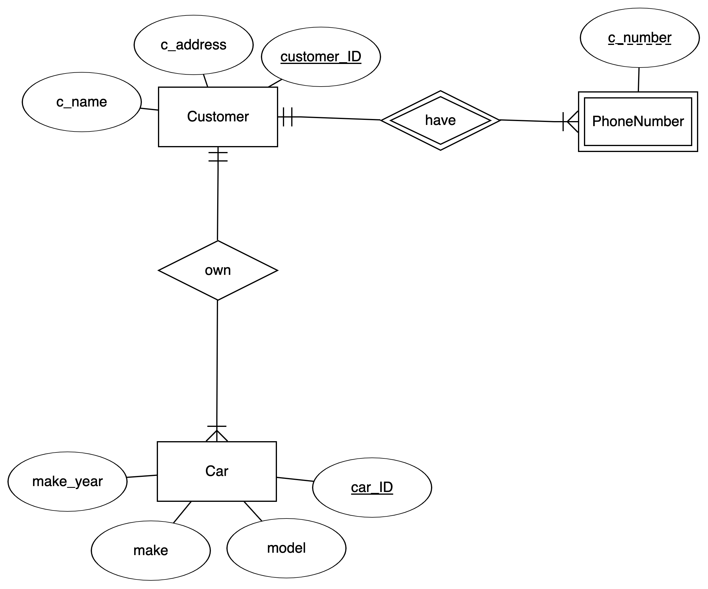
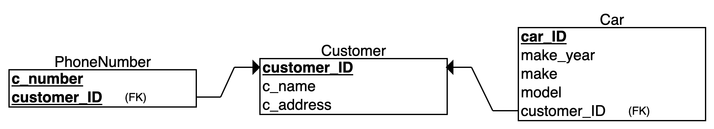

# Hot Wheel Auto Repair CS4604 Project

## Team Members
* vmanne20 - Vamsi Manne
* aarjab - Aarjab Goudel
* sid97 - Sid Hingorani
* mmk9624 - Carl Yao

## Project Description
Hot Wheels Auto Repair would like for your group to create a database backed application that will track customers and their cars. The system should track name, address and multiple phone numbers for each customer. It should also keep track of which cars belong to each customer. The year, make and model of each car should be tracked. Users should be able to update information about customers and their cars as well as add new customers and cars.

## Entity Relationship

The entities in this project are a *Customer*, a *Car*, and a *PhoneNumber*. A Customer *have* multiple phone numbers. A Customer *own* multiple cars.

A Customer is uniquely identified by *customer_ID*.  
A Car is uniquely identified by *car_ID*.  
A PhoneNumber is uniquely identified by *customer_ID* and *c_number*.  
We assume that a customer must have at least one car in the database.  
We assume that a customer must have at least one phone number in the database.  
We assume that customers’ name is not unique in the database, therefore we created customer_ID as the primary key.  
A customer may have multiple phone numbers, so we create PhoneNumber as a separate weak entity under Customer, because phone number cannot be identified without customer_ID.  

## Relational

The diagram below shows the entity-relationship diagram converted to a relational schema.

The corresponding sql can be found [here](sql/install.sql) and [here](sql/load.sql) .

## Build/Install/Run

### Docker Playground

Go to the [Docker Playground](http://play-with-docker.com) and confirm that you are not a robot.  
In the left-hand menu, click on "ADD NEW INSTANCE"  
This will start a Docker instance (node) and log you in as the root user.
Execute the following command:

`curl -o runme.sh -H "PRIVATE_TOKEN:Awx_423GF5ecYL9N9jB2" https://code.vt.edu/api/v4/projects/4275/repository/files/runme.sh/raw?ref=working-master && bash ./runme.sh`

This will start up a container listening on port 8080. Notice at the top of the page next to the
node's IP address there is now a link labeled **8080**. Click on that link to use the application.

### Linux

[Install Docker](https://docs.docker.com/install/#supported-platforms) on your favorite Linux machine.
Open a terminal, change directory into some work location and execute the following command:

`curl -o runme.sh -H "PRIVATE_TOKEN:Awx_423GF5ecYL9N9jB2" https://code.vt.edu/api/v4/projects/4275/repository/files/runme.sh/raw?ref=working-master && bash ./runme.sh`
