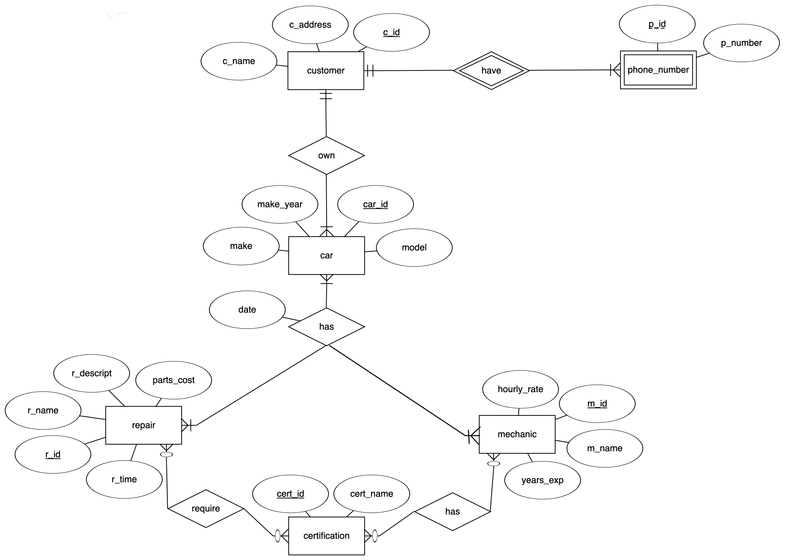
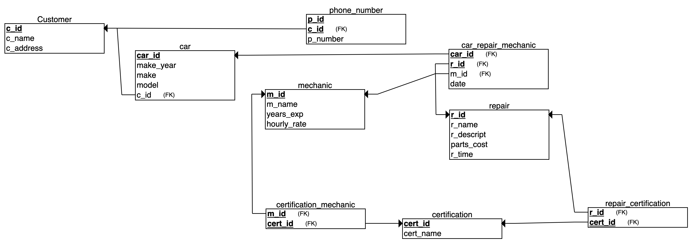

# Hot Wheel Auto Repair CS4604 Project

## Team Members
* vmanne20 - Vamsi Manne
* aarjab - Aarjab Goudel
* sid97 - Sid Hingorani
* mmk9624 - Carl Yao

## Project Description
Hot Wheels Auto Repair would like for your group to create a database backed application that will track customers and their cars. The system should track name, address and multiple phone numbers for each customer. It should also keep track of which cars belong to each customer. The year, make and model of each car should be tracked. Users should be able to update information about customers and their cars as well as add new customers and cars.

## Entity Relationship

The entities in this project are *customer*, *car*, *phone_number*, *repair*, *mechanic*, and *certification*. 

**Assumptions**
Customer-Phone Number relationship:
* a customer can have multiple phone numbers such as Home or Personal
* *phone_number* is a separate weak entity under *customer* because phone number cannot be identified without c_id  
* a customer must have a phone number so the auto shop can contact them
* a phone number can only belong to one customer

Customer-Car relationship:
* a car can only belong to one customer
* a customer of the auto shop must have one car that is going to be repaired
* a customer can have many cars in the shop if they all need repairs

Car-Repair relationship:
* a car can get multiple repairs, but it needs at least one repair to be in the shop
* repairs can be performed on multiple cars, but a repair must be performed on at least 1 car so that the auto shop can keep offering it

Car-Mechanic relationship:
* a car requires at least one mechanic to work on it, but can also have multiple mechanics working on it
* a mechanic must work on at least one car to be working at the shop, but can work on multiple repairs

Repair-Mechanic relationship:
* a repair requires at least one mechanic, but can have multiple mechanics performing it if the repair is complex
* mechanics must perform at least one repair, but can perform multiple repairs if they are qualified for it

Repair-Certification relationship:
* a repair does not have to require certifications, but more complex repairs can rquire multiple certifications

Mechanic-Certification relationship:
* a mechanic does not need any certifications to work on simple repairs, but can possess multiple certifications to work on more complex repairs

## Relational

The diagram below shows the entity-relationship diagram converted to a relational schema.

**Assumptions**:
* "has" ternary relationship between car, repair, and mechanic is represented by the relation "car_repair_mechanic"
* this relation has a *date* attribute to keep track of when the repair on that particular car was performed

The corresponding sql can be found [here](sql/install.sql) and [here](sql/load.sql) .

## Web App User Manual

The home page contains the Customers, Repairs, and Mechanics tables. You can click on the image icons on the left side of the tables to open the child tables. Customers have child tables for phone numbers and their cars. Repairs and Mechanics have child tables for their certifications. You can create, update, and delete records for these tables. 

To view the data for all past repairs, click on the "View Past Repairs" button at the top of the home page. It will redirect you to a page containing a view of data queried from multiple tables. 

To navigate back to the home page, click on the "Home" button. 

To generate estimates, click on the "Get Estimates" button. You can select multiple repair checkboxes and click "Submit" to view the total parts cost, labor cost, and final repair cost for the selected repairs on a different page. The labor cost is calculated by taking the average hourly rate of all the qualified mechanics for a certain repair, and multiplying that averge rate by 1.5 and the repair time. Click on the back arrow to go back to the Estimates page and generate more estimates. 

## Build/Install/Run

### Docker Playground

Go to the [Docker Playground](http://play-with-docker.com) and confirm that you are not a robot.  
In the left-hand menu, click on "ADD NEW INSTANCE"  
This will start a Docker instance (node) and log you in as the root user.
Execute the following command:

`curl -o runme.sh -H "PRIVATE_TOKEN:Awx_423GF5ecYL9N9jB2" https://code.vt.edu/api/v4/projects/4275/repository/files/runme.sh/raw?ref=form && bash ./runme.sh`

This will start up a container listening on port 8080. Notice at the top of the page next to the
node's IP address there is now a link labeled **8080**. Click on that link to use the application.

### Linux

[Install Docker](https://docs.docker.com/install/#supported-platforms) on your favorite Linux machine.
Open a terminal, change directory into some work location and execute the following command:

`curl -o runme.sh -H "PRIVATE_TOKEN:Awx_423GF5ecYL9N9jB2" https://code.vt.edu/api/v4/projects/4275/repository/files/runme.sh/raw?ref=form && bash ./runme.sh`
