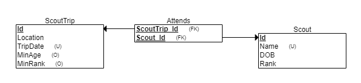

# ScoutMasters CS4604 Project

## Team Members
* rquintin
*  ...

## Project Description
The Scoutmaster for a local Scout troop would like to track which scouts have attended scouting trips. Each trip occurs on a specific date and at a specific location. Some trips require a minimum age or scout rank in order to attend.

Each scout has a name, date of birth and rank.

Develop a system to track scouts, trips and which scouts have attended each trip.

## Entity Relationship

The entities in this project are a *ScoutTrip* and a *Scout*. A Scout *Attends* a ScoutTrip. 

A ScoutTrip is uniquely identified by the *TripDate*.
A Scout is uniquely identified by the *Name*.
Many Scouts Attend many ScoutTrips.

## Relational

The diagram below shows the entity-relationship diagram converted to a relational schema.

The corresponding sql can be found [here](sql/install.sql).

## Build/Install/Run

### Docker Playground

Go to the [Docker Playground](http://play-with-docker.com) and confirm that you are not a robot.  
In the left-hand menu, click on "ADD NEW INSTANCE"  
This will start a Docker instance (node) and log you in as the root user. 
Execute the following command:

`curl -o runme.sh https://code.vt.edu/rquintin/CS4604-project/raw/master/runme.sh && bash ./runme.sh`

### Linux

[Install Docker](https://docs.docker.com/install/#supported-platforms) on your favorite Linux machine.
Open a terminal, change directory into some work location and execute the following command:

`curl -o runme.sh https://code.vt.edu/rquintin/CS4604-project/raw/master/runme.sh && bash ./runme.sh`

